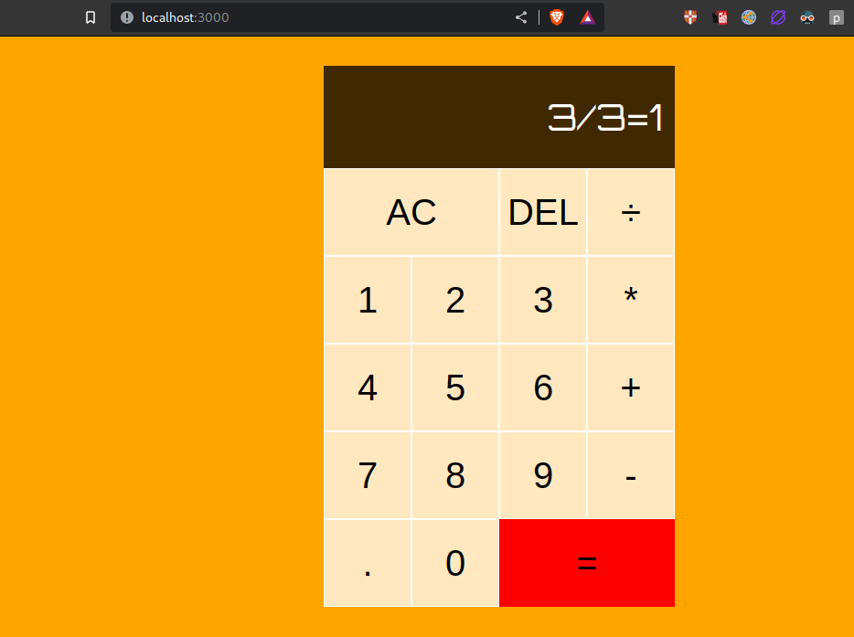

# Basic Calculator 📟 created using reactjs

### Preview 🖼

## In order to try this fully functioning calculator follow insturctions 📑  below👇

### `npm install`

Install all dependencies to run application.

### `npm start`

Runs the app in the development mode.\
Open [http://localhost:3000](http://localhost:3000) to view it in your browser.

